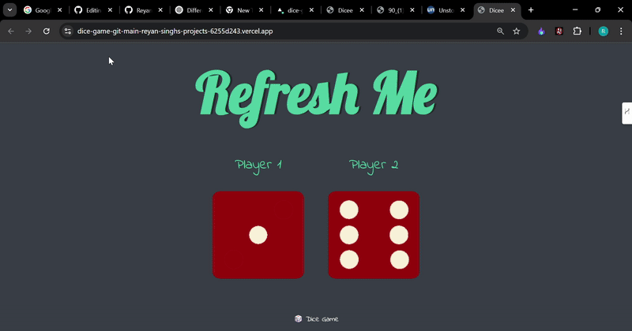

# 🎲 Dice Game

Welcome to **Dice Game**! A fun and simple game built using **HTML, CSS, and JavaScript**. Challenge your friends and test your luck by rolling the dice! 🎯

## 🚀 How to Play
1. Open the game in your browser.
2. Click the **Refresh** button or reload the page to roll the dice.
3. The player with the **higher number** wins!
4. If both players roll the same number, it's a **draw**.

## 🎮 Features
✅ Simple and interactive UI  
✅ Two-player gameplay  
✅ Random dice rolls using JavaScript  
✅ Refresh to start a new round  

## 🖼 Demo


## 🛠 Technologies Used
- **HTML** → Structure of the game  
- **CSS** → Styling for an engaging UI  
- **JavaScript** → Logic for rolling the dice and deciding the winner  

## 📂 How to Run Locally
1. Clone this repository:  
   ```bash
   git clone https://github.com/your-username/dice-game.git

2. Navigate to the project folder:
   ```bash
   cd dice-game

3. Open index.html in your browser.
